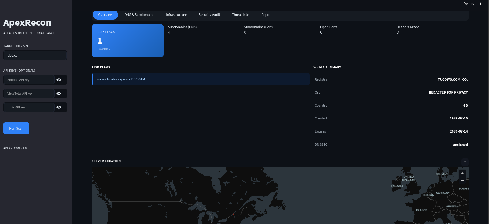
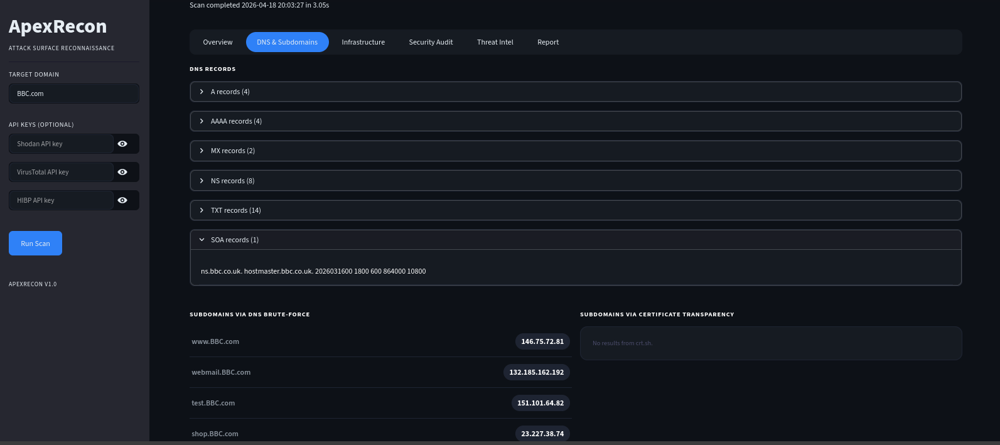
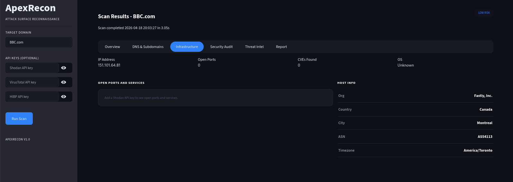
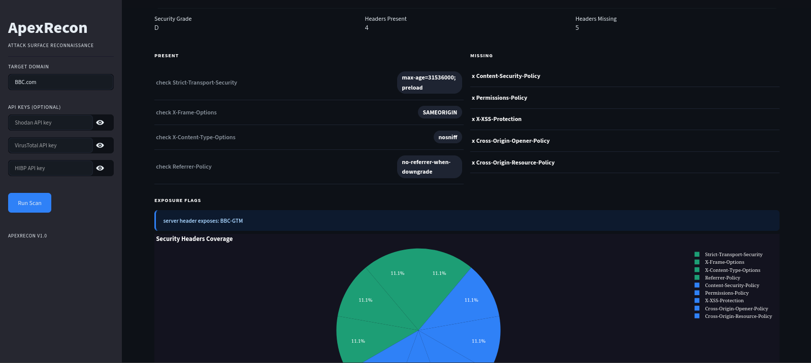
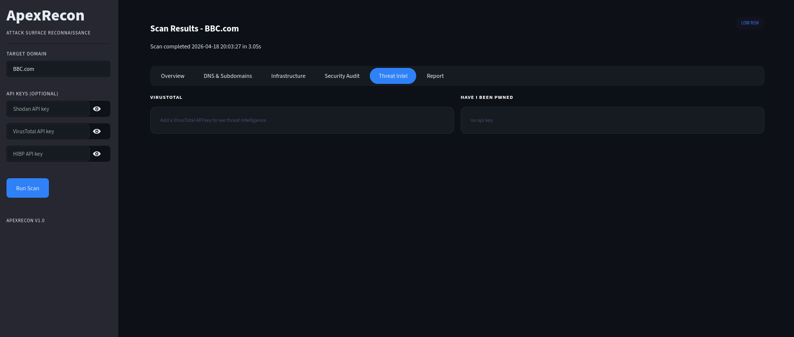
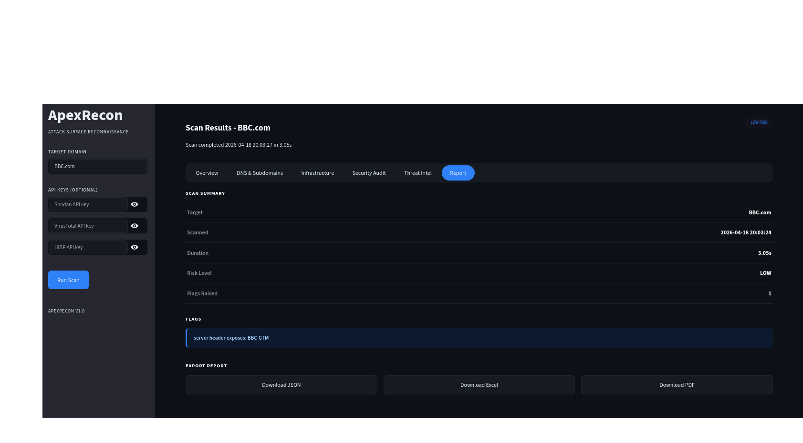

# ApexRecon

## Overview

ApexRecon is an automated attack surface reconnaissance framework built for passive domain intelligence gathering. The tool chains multiple intelligence sources into a single scan and presents the results through an interactive dashboard.

During my studies, passive reconnaissance was covered as a manual process, running WHOIS lookups, checking certificate transparency logs, querying DNS records one at a time across different tools and browser tabs. This project automates that entire workflow. Given a domain, ApexRecon runs all modules in sequence, aggregates the output, scores the risk level, and produces a structured report that can be exported as JSON, Excel, or PDF.

---

## Dashboard

**Overview: risk flags, WHOIS summary, server location map and scan metadata**



**DNS and Subdomains: DNS records, brute-forced subdomains and certificate transparency results**



**Infrastructure: open ports, running services, CVEs and host information via Shodan**



**Security Audit: HTTP security headers present and missing, graded A to F**



**Threat Intel: VirusTotal vendor analysis and Have I Been Pwned breach results**



**Report: scan summary with JSON, Excel and PDF export**



---

## Reconnaissance Modules

| Module | Source | Description |
|--------|--------|-------------|
| WHOIS | python-whois | Domain registration data, registrar, creation and expiry dates, registrant emails |
| DNS Enumeration | dnspython | A, MX, NS, TXT, CNAME, SOA records and subdomain brute-force |
| Certificate Transparency | crt.sh | Subdomain discovery from SSL certificate logs, no API key required |
| GeoIP | ipapi.co | IP resolution and server location mapping |
| HTTP Headers | requests | Security header audit with A-F grading |
| Shodan | Shodan API | Open ports, running services, CVEs, OS fingerprinting |
| VirusTotal | VirusTotal API | Domain reputation and vendor analysis breakdown |
| Have I Been Pwned | HIBP API | Breach check on emails discovered during WHOIS |

---

## Report Output

Each scan produces a risk summary with flagged findings and structured data per module. Reports can be exported from the dashboard in three formats:

| Format | Contents |
|--------|----------|
| JSON | Full raw scan output |
| Excel | Summary, DNS and Subdomains, Open Ports, Headers Audit |
| PDF | Summary, flags, WHOIS data, subdomains, headers grade |

---

## Repository Structure

```
ApexRecon/
├── modules/
│   ├── whois_lookup.py
│   ├── dns_enum.py
│   ├── cert_log.py
│   ├── geoip.py
│   ├── header_audit.py
│   ├── shodan_scan.py
│   ├── virustotal_check.py
│   └── hibp_check.py
├── core/
│   └── scanner.py
├── dashboard/
│   └── app.py
├── reports/
├── docs/
│   └── screenshots/
├── main.py
├── requirements.txt
└── README.md
```

---


## Running the Tool

Launch the dashboard:

```bash
python3 main.py
```

Open `http://localhost:8501`, enter a domain in the sidebar, add API keys if available, and run the scan.

Headless scan (saves report to `reports/`):

```bash
python3 main.py --scan example.com
python3 main.py --scan example.com --shodan YOUR_KEY --vt YOUR_KEY --hibp YOUR_KEY
```

---

## API Keys

Three modules require API keys. All have free tiers.

| Module | Link |
|--------|------|
| Shodan | https://account.shodan.io |
| VirusTotal | https://www.virustotal.com/gui/my-apikey |
| Have I Been Pwned | https://haveibeenpwned.com/API/Key |

Keys are entered in the dashboard sidebar or passed as CLI flags. They are not stored anywhere.

---

## Risk Scoring

After each scan, ApexRecon calculates a risk level based on the number of flags raised across all modules.

| Flags | Risk Level |
|-------|------------|
| 0-1 | Low |
| 2-3 | Medium |
| 4+ | High |

Flags are raised for recently registered domains, exposed server headers, malicious vendor detections, CVEs found via Shodan, and breached emails.
